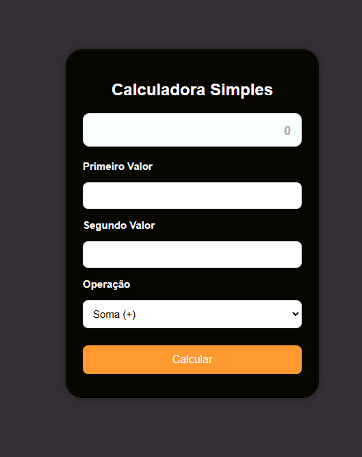

# Calculadora Simples em PHP

<p align="center">
  
</p>

Este projeto é uma calculadora básica feita em **PHP**, **HTML** e **CSS**, permitindo realizar operações simples entre dois números.

## Funcionalidades

- Soma  
- Subtração  
- Multiplicação  
- Divisão (com verificação de divisão por zero)

## Tecnologias usadas

- PHP 8  
- HTML5  
- CSS3  
- XAMPP

## Como usar

1. Coloque os arquivos na pasta:
```
C:\xampp\htdocs\php\
```
2. Inicie o Apache pelo XAMPP.
3. Acesse no navegador:
```
http://localhost/php/
```
4. Preencha os campos, selecione a operação e clique em **Calcular**.

## Estrutura

```
📁 calculadora
 ├── calc.php
 ├── image.png
 └── README.md
```
