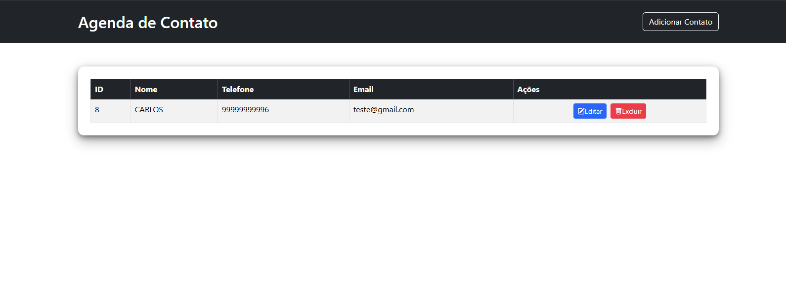
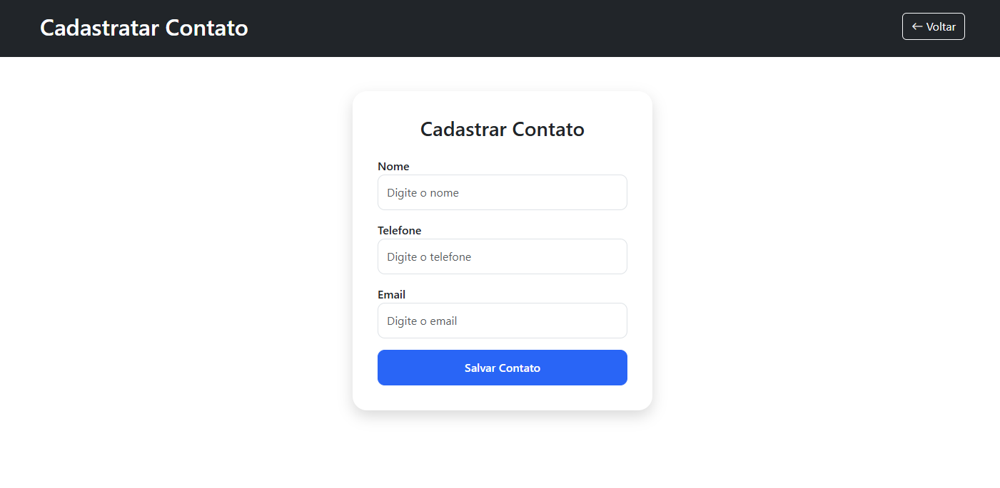

# 📒 Sistema de Agenda (CRUD em PHP)

Este projeto é uma aplicação de agenda desenvolvida em **PHP** com **MySQL**, permitindo cadastrar, listar, editar e excluir contatos.

## 🖼 Prévia do Sistema





## 🚀 Funcionalidades
- Adicionar novos contatos
- Listar contatos
- Editar informações
- Excluir registros
- Conexão com MySQL usando `mysqli`

## 🗂 Estrutura
```
aula3/
├── adicionar.php
├── editar.php
├── excluir.php
├── index.php
├── conexao.php
├── image1.png
├── image2.png
└── image3.png
```

## 🗄 Banco de Dados
```sql
CREATE TABLE contatos (
    id INT AUTO_INCREMENT PRIMARY KEY,
    nome VARCHAR(100),
    telefone VARCHAR(20),
    email VARCHAR(100)
);
```

## ▶ Como rodar
1. Colocar a pasta no `htdocs`
2. Criar o banco `agenda`
3. Importar a tabela acima
4. Acessar: `http://localhost/aula3/`
