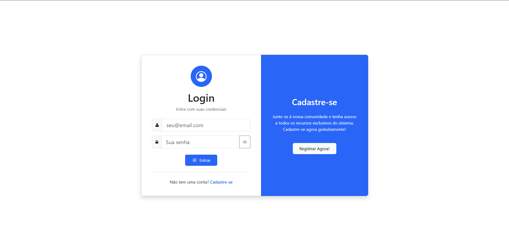
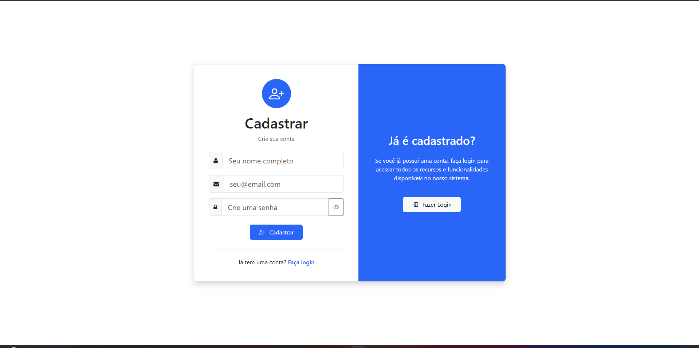
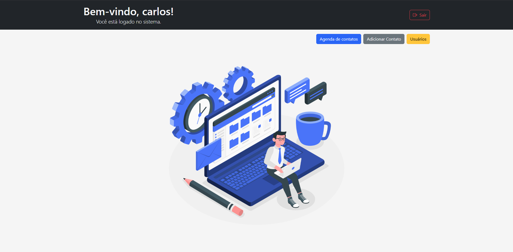
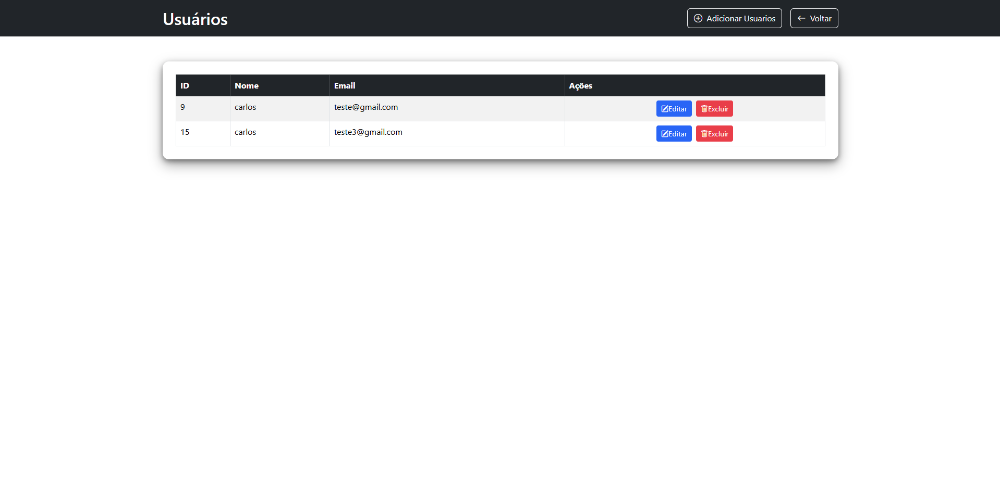

# 📂 Sistema de Agenda em PHP

Aplicação simples de agenda desenvolvida em PHP com MySQL. O sistema permite cadastrar usuários, fazer login, registrar contatos, editar, excluir e visualizar as informações em uma interface organizada.

As telas incluem login, cadastro, home, gerenciamento de usuários e agenda.

## 🚀 Funcionalidades

• Cadastro de usuários  
• Login e autenticação usando sessões  
• Registro de contatos  
• Listagem de contatos  
• Edição de contatos  
• Exclusão de contatos  
• Logout  
• Interface simples usando Bootstrap  

## 📸 Screenshots

### Tela de Login  


### Tela de Registro  


### Home da Agenda  


### Criar Contato  


### Página do Usuário  


### Estrutura da Aplicação  


## 🛠️ Tecnologias Utilizadas

• PHP  
• MySQL  
• HTML  
• Bootstrap  
• Sessions nativas do PHP  

## 📁 Estrutura do Projeto

```
aula3/
├─ assets/
│  ├─ agenda.png
│  ├─ home.png
│  ├─ login.png
│  ├─ register.png
│  ├─ user.png
│  └─ workHome.png
├─ controllers/
│  ├─ adicionar.php
│  ├─ adicionarUser.php
│  ├─ editar.php
│  ├─ editarUser.php
│  ├─ excluir.php
│  ├─ excluirUser.php
│  ├─ loginAction.php
│  ├─ logout.php
│  └─ registerAction.php
├─ pages/
│  ├─ home.php
│  ├─ index.php
│  ├─ login.php
│  ├─ register.php
│  └─ user.php
├─ conexao.php
├─ estrurura.png
├─ estrurura.tldr
└─ readme.md
```

## 🔧 Configuração

1. Importe o banco no MySQL.  
2. Ajuste a conexão no arquivo `conexao.php`.  
3. Coloque o projeto no servidor local (XAMPP).  
4. Acesse no navegador:  
   `http://localhost/aula3/pages/login.php`

## 📜 Licença

Livre para estudar, modificar e melhorar.
